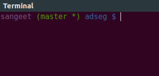

Every time I re-install Ubnutu I have to search the web for the custom shell and git promp configurations.
They are really handy for git completions.

<hr>



<hr>

This time I thought to just put it down here.

Steps :
* Download : [git-prompt.sh](https://raw.githubusercontent.com/git/git/master/contrib/completion/git-prompt.sh)
* Save the above file as `git-prompt.sh` in the home directory
* Download : [git-completion.bash](https://raw.githubusercontent.com/git/git/master/contrib/completion/git-completion.bash)
* Save the above file as `git-completion.bash` in the home directory
* Now open `.bashrc` file in any text editor and these lines at the end


<br>
<hr>

```sh
# enable programmable completion features (you don't need to enable
# this, if it's already enabled in /etc/bash.bashrc and /etc/profile
# sources /etc/bash.bashrc).
if ! shopt -oq posix; then
  if [ -f /usr/share/bash-completion/bash_completion ]; then
    . /usr/share/bash-completion/bash_completion
  elif [ -f /etc/bash_completion ]; then
    . /etc/bash_completion
  fi
fi

# Enable tab completion
source ~/git-completion.bash

# colors!
green="\[\033[0;32m\]"
blue="\[\033[0;34m\]"
purple="\[\033[0;35m\]"
reset="\[\033[0m\]"

# Change command prompt
source ~/git-prompt.sh
export GIT_PS1_SHOWDIRTYSTATE=1
# '\u' adds the name of the current user to the prompt
# '\$(__git_ps1)' adds git-related stuff
# '\W' adds the name of the current directory
export PS1="$purple\u$green\$(__git_ps1)$blue \W $ $reset"
```

<hr>
Acknowledgements : https://in.udacity.com/course/how-to-use-git-and-github--ud775